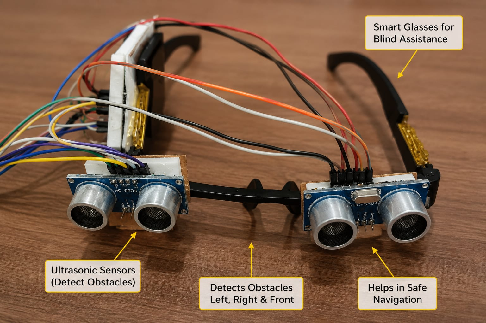
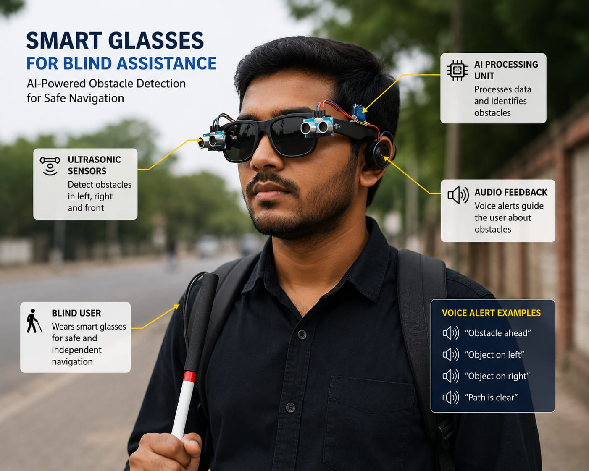
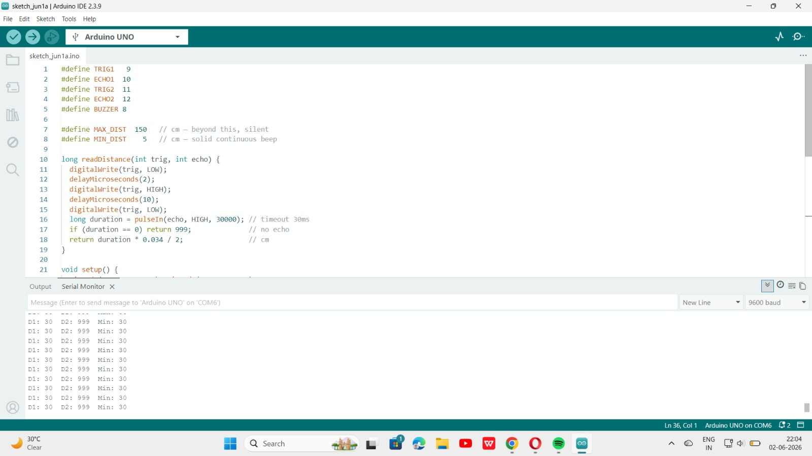
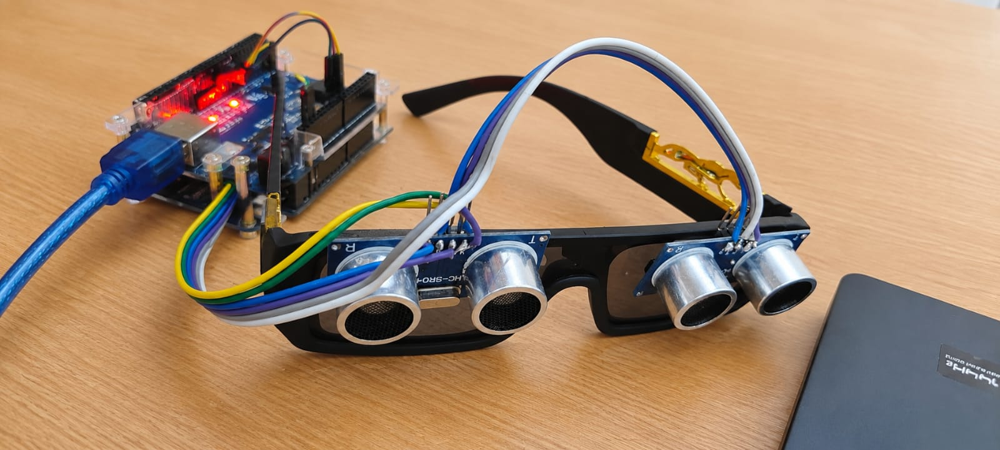

# 🦯 Smart Navigation Assistant for Visually Impaired
 
An AI-assisted, IoT-based obstacle detection system designed to help visually impaired individuals navigate their surroundings safely and independently. The system uses ultrasonic sensors to detect nearby obstacles and provides real-time feedback through a buzzer, with beep intensity increasing as obstacles get closer.
 
---
 
## 📌 Problem Statement
 
Visually impaired individuals often rely on canes or human assistance to navigate unfamiliar environments, which can be limiting and sometimes unsafe. This project aims to provide an affordable, wearable-style electronic aid that detects obstacles in real time and alerts the user through intuitive audio feedback — without requiring internet connectivity or complex hardware.
 
---
 
## ⚙️ How It Works
 
1. Two **HC-SR04 ultrasonic sensors** continuously measure distance to nearby obstacles from two different directions.
2. The **Arduino Mega** reads both sensor values and calculates the **minimum distance** (i.e., the closest obstacle).
3. Based on this distance, a **buzzer** provides feedback:
   - **Closer obstacle → shorter beep interval → more frequent/urgent beeping**
   - **Farther obstacle → longer beep interval → less frequent beeping**
   - **No obstacle within range (150 cm) → buzzer stays silent**
4. Live distance readings are also printed to the **Serial Monitor** for debugging and testing purposes.
This creates an intuitive, proportional feedback system — the user doesn't need to interpret numbers, just the urgency of the beeping.
 
---
 
## 🛠️ Components Used
 
| Component | Quantity | Purpose |
|---|---|---|
| Arduino Mega | 1 | Main microcontroller |
| HC-SR04 Ultrasonic Sensor | 2 | Obstacle distance detection |
| Buzzer | 1 | Audio feedback to user |
| Jumper Wires | As needed | Connections |
| Breadboard / Enclosure | 1 | Mounting components |
 
### Pin Configuration
 
| Component | Pin |
|---|---|
| Sensor 1 - TRIG | 9 |
| Sensor 1 - ECHO | 10 |
| Sensor 2 - TRIG | 11 |
| Sensor 2 - ECHO | 12 |
| Buzzer | 8 |
 
---
 
## 💻 Code
 
The full Arduino sketch is available here: [`SmartNavigationAssistant.ino`](./SmartNavigationAssistant.ino)
 
**Key logic:**
- `readDistance()` function triggers each ultrasonic sensor and calculates distance using the pulse duration.
- If no echo is received within 30ms (timeout), the sensor returns a large default value (999) to avoid false triggers.
- `map()` and `constrain()` are used to convert distance into a proportional buzzer beep interval (30ms–600ms), so the feedback intensity scales smoothly with proximity.
---
 
## 🚀 Future Improvements
 
- Add a **vibration motor** as an alternative feedback mode for noisy environments
- Integrate a **GPS module** for location tracking and emergency alerts
- Make the design **wearable** (belt or cane-mounted) for better usability
- Add **rechargeable battery support** for portability
- Explore **machine learning-based obstacle classification** (e.g., distinguishing between static and moving obstacles)
---
 
## 📸 Demo / Circuit Diagram
 
### Hardware Setup — Sensor Wiring

 
### Concept Overview

 
### Code Running — Serial Monitor Output

 
### Actual Hardware Connection

 
### 🎥 Testing Demo Videos
- [Testing Demo 1](./videos/testing-demo-1.mp4)
- [Testing Demo 2](./videos/testing-demo-2.mp4)
---
 
## 👩‍💻 Author
 
**Khushi Singh**
B.Tech (AI & ML), Khalsa College of Engineering & Technology, Amritsar
 
- GitHub: [khushisingh916228-droid](https://github.com/khushisingh916228-droid)
- Portfolio: [khushisingh916228-droid.github.io](https://khushisingh916228-droid.github.io)
- LinkedIn: *add your LinkedIn URL here*
- Email: *add your email here*
---
 
⭐ If you found this project interesting, consider giving it a star!
 
